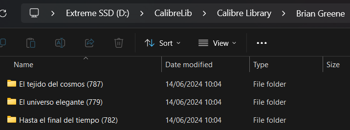
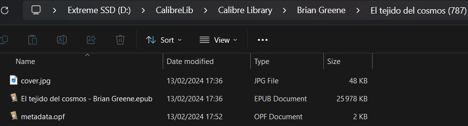

# LectulandiaExtractor

> **_Las personas libres jamás podrán concebir lo que los libros significan para quienes vivimos encerrados_**

## Descripción

Repo para descargar libros en _español_ en formato _epub_ programáticamente desde el dominio [Lectulandia](https://ww3.lectulandia.com/).

El programa permite, a partir de un autor dado, escoger desde la colección de libros del autor existente en [Lectulandia](https://ww3.lectulandia.com/) y descargar los libros seleccionados dentro de un directorio local (el cual puede ser modificado a través de la CLI).

> El objetivo es poder facilitar y automatizar el proceso de armado de una biblioteca digital en forma ordenada y rápida.

El código se trata de un scrapper basado en _Robobrowser_, el cual maneja _BeautifulSoup_ por detrás para navegar y parsear el contenido de la página web.

A su vez, la portada de cada libro es descargadas utilizando **Google Books API**. Cada libro es guardado dentro de una subcarpeta, que contiene tanto el libro en formato _.epub_ como la portada en formato _.jpg_.

La función de descarga posee además un paginador, de forma tal que no solo se descargue la primera página del autor visible en la interfaz, sino la totalidad de páginas.

Para conservar el orden de la biblioteca local, se lleva a cabo un fuzzy matching en dos etapas:

- En primer lugar, se compara el nombre del autor actual a descargar con una posible carpeta de dicho actual preexistente en el directorio local. Si tal existe, se utiliza el nombre preexistente en lugar del actual para evitar duplicados.
- En segundo lugar, se compara el libro a descargar con la lista de libros preexistentes para dicho autor. En caso de existir, se omite la descarga del libro.

_Forked_ desde repo original [LectulandiaExtractor](https://github.com/Sarrablo/LectulandiaExtractor).

## Requisitos previos

- Instalar **pipx**

```bash
python -m pip install --user pipx
python -m pipx ensurepath
```

- Instalar **uv**

```bash
pipx install uv
```

Instalar y activar **virtual env**

```bash
uv venv
.venv\Scripts\activate
```

- Instalar **dependencias**

```bash
uv install
```

## Scripts

- `extractor.py`: script de descarga de archivos
- `CLI.py`: Command Line Interface para correr el código a través de la terminal.
  Flags:
  - `--author`: Nombre de autor desde el cual descargar libros
  - `--proxy`: Proxy para los requests
  - `--output-dir`: Directorio local en donde descargar los libros

## Notebooks

- `orphan_remover`: función para remover archivos huérfanos de tipo .epub y .mobi, luego de haber indexado la base de datos de Calibre.

Para ejecutar la CLI, simplemente dirigirse a `/scripts` y correr:

```bash
python -m CLI
```

## Screenshots





## Referencias

- [LectureMap](https://www.literature-map.com/)
- [AI-Book-Downloader](https://github.com/JuanMartinElorriaga/ai-book-downloader)
