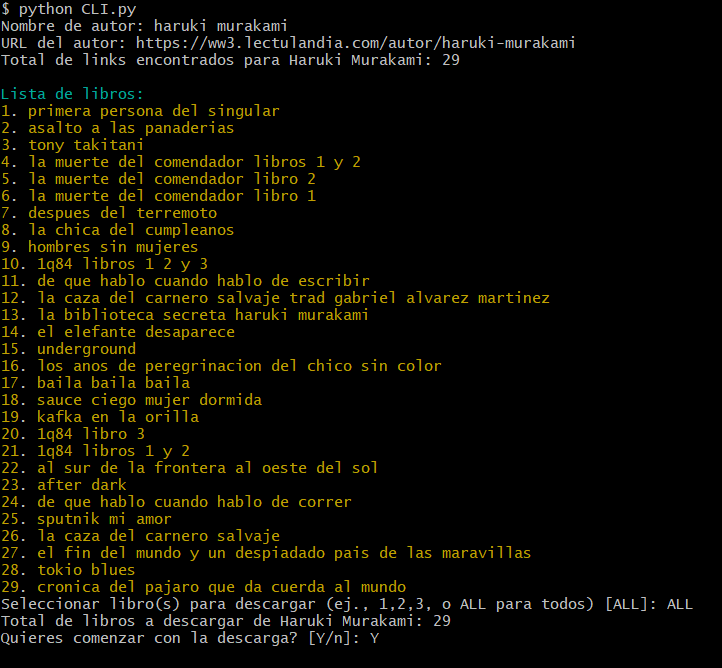
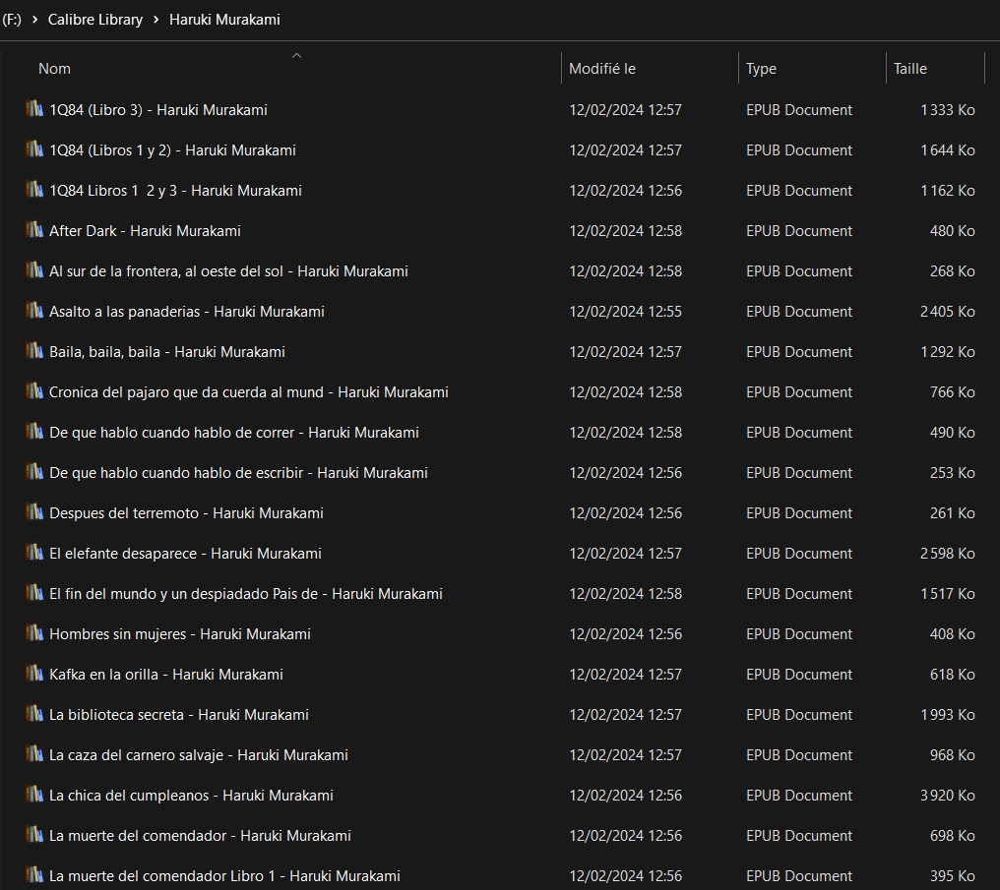

# LectulandiaExtractor
> ***Las personas libres jamás podrán concebir lo que los libros significan para quienes vivimos encerrados***


## Descripción
Repo para descargar libros en *español* en formato *epub* programáticamente desde el dominio [Lectulandia](https://ww3.lectulandia.com/).

El programa permite, a partir de un autor dado, escoger desde la colección de libros del autor existente en [Lectulandia](https://ww3.lectulandia.com/) y descargar los libros escogidos dentro de un directorio local (el cual puede ser modificado a través de la CLI).

>El objetivo es poder facilitar y automatizar el proceso de armado de una biblioteca digital en forma ordenada y rápida

El código se trata de un scrapper basado en *Robobrowser*, el cual maneja *BeautifulSoup* por detrás para navegar y parsear el contenido de la página web.

La función de descarga posee además un paginador, de forma tal que no solo se descargue la primera página del autor visible en la interfaz, sino la totalidad de páginas.

*Forked* desde repo original [LectulandiaExtractor](https://github.com/Sarrablo/LectulandiaExtractor).

## Scripts
- `extractor.py`: script de descarga de archivos
- `CLI.py`: Command Line Interface para correr el código a través de la terminal.
    - `--author`: Nombre de autor desde el cual descargar libros
    - `--proxy`: Proxy para los requests
    - `--output-dir`: Directorio local en donde descargar los libros

Para ejecutar la CLI, simplemente dirigirse a `/scripts` y correr:
 ```bash
 python CLI.py
 ```


## Screenshots






### TODO
-  Resolver problema de que a partir de cierta número de descargas, el scripts comienza a devolver None y las descargas comienzan a fallar. Mientras tanto, es necesario esperar unos minutos y volver a comenzar.