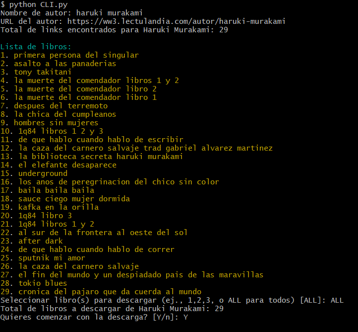
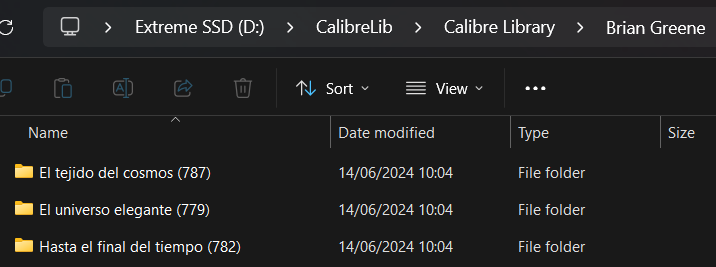
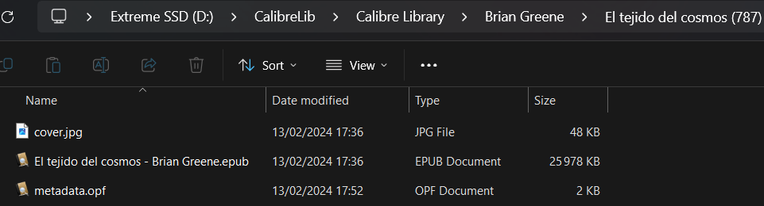

# LectulandiaExtractor

> **_Las personas libres jamás podrán concebir lo que los libros significan para quienes vivimos encerrados_**

## Descripción

Herramienta para descargar libros en **español** en formato **EPUB** programáticamente desde [Lectulandia](https://ww3.lectulandia.com/).

El programa permite, a partir de un autor dado, escoger libros de su colección en Lectulandia y descargarlos de forma organizada en un directorio local.

> El objetivo es facilitar y automatizar el proceso de armado de una biblioteca digital ordenada y rápida.

### ✨ Características v0.2.0

- ✅ **Descarga automática con retry** - Reintentos automáticos con backoff exponencial
- ✅ **Validación de EPUB** - Verifica integridad de archivos descargados
- ✅ **Progress bars visuales** - Interfaz moderna con Rich
- ✅ **Portadas automáticas** - Descarga de Google Books API
- ✅ **Anti-duplicados inteligente** - Fuzzy matching para evitar descargas repetidas
- ✅ **Rate limiting adaptativo** - Delays aleatorios para evitar bloqueos
- ✅ **Modo dry-run** - Vista previa sin descargar
- ✅ **Integración con Calibre** - Sincronización automática con tu biblioteca
- ✅ **Configuración flexible** - Personalizable via archivo .env

### 🔧 Tecnologías

- **httpx** - Cliente HTTP moderno con soporte HTTP/2
- **BeautifulSoup4** - Parsing HTML robusto
- **Rich** - Interfaz de terminal moderna
- **Tenacity** - Retry automático inteligente
- **Pydantic** - Configuración validada

---

## 🚀 Inicio Rápido

### 1. Instalar UV (gestor de paquetes)

```bash
# macOS/Linux
curl -LsSf https://astral.sh/uv/install.sh | sh

# O con brew (macOS)
brew install uv

# O con pip
pip install uv
```

### 2. Clonar e Instalar

```bash
# Clonar el repositorio
git clone https://github.com/TU_USUARIO/LectulandiaExtractor.git
cd LectulandiaExtractor

# Instalar dependencias (crea automáticamente el .venv)
uv sync
```

### 3. Configurar (Opcional)

Edita el archivo `.env` con tus rutas preferidas:

```bash
nano .env
```

```bash
# Carpeta donde se descargarán los libros
DEFAULT_DOWNLOAD_FOLDER=/Users/tu_usuario/Downloads/Libros

# Carpeta de tu biblioteca Calibre (opcional)
DEFAULT_CALIBRE_LIBRARY=/Users/jelorriaga/Documents/Libros
```

### 4. ¡Listo! Descarga tu primer libro

```bash
# Opción 1: Usar el script wrapper (más fácil)
./run.sh --author "gabriel garcia marquez"

# Opción 2: Usar make
make download AUTHOR="gabriel garcia marquez"

# Opción 3: Modo interactivo
./run.sh
```

---

## 📖 Uso

### Métodos de Ejecución

#### 1. **Script Wrapper** (Recomendado - Más simple)

```bash
# Interactivo (te pregunta todo)
./run.sh

# Con autor específico
./run.sh --author "julio cortazar"

# Vista previa sin descargar (dry-run)
./run.sh --author "borges" --dry-run

# Con rutas personalizadas
./run.sh --author "vargas llosa" \
  --download_folder "./mis_libros" \
  --calibre_library "./mi_calibre"

# Con proxy
./run.sh --author "garcia marquez" --proxy "http://proxy:8080"
```

#### 2. **Usando Make** (Conveniente)

```bash
# Ver comandos disponibles
make help

# Descargar libros
make download AUTHOR="garcia marquez"

# Vista previa
make dry-run AUTHOR="borges"

# Ver logs recientes
make logs

# Limpiar archivos temporales
make clean
```

#### 3. **Usando Python directamente**

```bash
PYTHONPATH=. .venv/bin/python scripts/CLI.py --author "cortazar"
```

### Opciones del CLI

```
Opciones:
  --author TEXT             Nombre de autor desde el cual descargar libros
  --download_folder PATH    Directorio local para descargar los libros
                            (default: desde .env)
  --calibre_library PATH    Directorio de la librería Calibre
                            (default: desde .env)
  --proxy TEXT              Proxy para los requests (ej: http://proxy:8080)
  --dry-run                 Simular descarga sin descargar archivos (preview)
  --help                    Mostrar ayuda
```

---

## 🎯 Ejemplos de Uso

### Ejemplo 1: Descarga básica

```bash
./run.sh --author "gabriel garcia marquez"
```

Resultado:
- Te muestra lista de 41 libros encontrados
- Puedes seleccionar: `1,2,3` o `ALL` para todos
- Descarga con progress bar visual
- Valida cada EPUB descargado
- Descarga portadas automáticamente
- Muestra tabla de resumen al finalizar

### Ejemplo 2: Vista previa (dry-run)

```bash
./run.sh --author "julio cortazar" --dry-run
```

Perfecto para:
- Ver qué libros están disponibles
- Verificar URLs antes de descargar
- Planear descargas grandes

### Ejemplo 3: Selección específica

```bash
./run.sh --author "borges"
# Cuando te pregunte, escribe: 1,5,10
```

Descarga solo los libros 1, 5 y 10 de la lista.

### Ejemplo 4: Integración con Calibre

```bash
./run.sh --author "vargas llosa" \
  --calibre_library "/Users/tu_usuario/CalibreLibrary"
```

Al finalizar, te preguntará si quieres sincronizar con Calibre.

**⚠️ Importante**: Cierra Calibre Desktop antes de sincronizar.

---

## 📁 Estructura de Archivos

### Descargados

```
downloads/
└── Gabriel Garcia Marquez/
    ├── Cien años de soledad/
    │   ├── Cien años de soledad.epub
    │   └── cover.jpg
    └── El amor en los tiempos del cólera/
        ├── El amor en los tiempos del cólera.epub
        └── cover.jpg
```

### Proyecto

```
LectulandiaExtractor/
├── config/               # Configuración centralizada
│   ├── __init__.py
│   └── settings.py       # Settings con pydantic
├── src/                  # Código fuente modular
│   ├── infrastructure/
│   │   └── http/
│   │       └── http_client.py  # Cliente HTTP con retry
│   └── utils/
│       ├── validators.py       # Validación EPUB, sanitización
│       └── delays.py           # Rate limiting
├── scripts/              # Scripts principales
│   ├── CLI.py           # Interfaz de línea de comandos
│   ├── extractor.py     # Lógica de descarga
│   └── calibre_utils.py # Integración Calibre
├── logs/                # Logs rotativos (30 días)
├── .env                 # Tu configuración personal
├── .env.example         # Plantilla de configuración
├── run.sh              # Script wrapper
├── Makefile            # Comandos make
└── README.md
```

---

## 🔧 Configuración Avanzada

### Archivo .env

Personaliza el comportamiento editando `.env`:

```bash
# Rate Limiting - Ajusta según tu conexión
REQUEST_DELAY_MIN=2.0      # Delay mínimo entre requests (segundos)
REQUEST_DELAY_MAX=5.0      # Delay máximo entre requests
MAX_RETRIES=3              # Intentos antes de fallar

# Fuzzy Matching - Qué tan similar para considerar duplicado (0-100)
AUTHOR_MATCH_THRESHOLD=90
BOOK_MATCH_THRESHOLD=90

# Timeouts
DOWNLOAD_TIMEOUT=180       # Timeout para descargar EPUB (segundos)
REQUEST_TIMEOUT=30
CONNECT_TIMEOUT=10

# Límites
MAX_PAGINATION_DEPTH=50    # Máximo de páginas a scrapear
```

### Logs

Los logs se guardan automáticamente en `logs/`:

```bash
# Ver logs recientes
tail -f logs/downloader_$(date +%Y-%m-%d).log

# O con make
make logs
```

Rotación automática:
- Nueva archivo cada medianoche
- Compresión ZIP automática
- Retención: 30 días

---

## ⚙️ Cómo Funciona

### Flujo de Descarga

1. **Scraping del autor**
   - Busca autor en Lectulandia
   - Scrapea todas las páginas (paginación automática)
   - Extrae URLs de libros

2. **Selección de libros**
   - Muestra lista interactiva
   - Usuario selecciona cuáles descargar

3. **Proceso de descarga** (por cada libro)
   - Obtiene link de descarga desde Lectulandia
   - Navega a antupload.com
   - Extrae link final con anti-bot protection
   - Descarga EPUB con retry automático
   - **Valida** que sea un EPUB válido
   - Descarga portada desde Google Books API
   - Guarda en estructura de carpetas organizada

4. **Fuzzy Matching Anti-duplicados**
   - Compara autor con carpetas existentes en Calibre
   - Compara libro con libros existentes del autor
   - Omite si ya existe (configurable threshold)

5. **Integración Calibre** (opcional)
   - Sincroniza carpeta completa del autor
   - Usa `calibredb` CLI

---

## 🛡️ Seguridad y Robustez

### Características de Seguridad

- ✅ **Sanitización de paths** - Previene path traversal attacks
- ✅ **Validación de EPUB** - Verifica estructura ZIP + mimetype
- ✅ **User-Agent rotation** - Evita detección como bot
- ✅ **Rate limiting inteligente** - Delays aleatorios
- ✅ **Retry automático** - 3 intentos con backoff exponencial

### Manejo de Errores

- **Timeout**: Reintentos automáticos con backoff
- **Rate limiting (429)**: Reintenta con delay mayor
- **EPUB corrupto**: Elimina y reporta error
- **Error en un libro**: Continúa con los siguientes

---

## 🐛 Troubleshooting

### Problema: "No module named 'src'"

```bash
# Asegúrate de usar PYTHONPATH=. o el script wrapper
./run.sh  # En lugar de python scripts/CLI.py
```

### Problema: "calibredb: command not found"

```bash
# Opción 1: Agregar Calibre al PATH (macOS)
export PATH="/Applications/calibre.app/Contents/MacOS:$PATH"

# Opción 2: No uses la opción de sincronización con Calibre
```

### Problema: Descargas muy lentas

```bash
# Reduce los delays en .env
REQUEST_DELAY_MIN=1.0
REQUEST_DELAY_MAX=2.0
```

⚠️ **Nota**: Delays muy bajos pueden causar bloqueos del sitio.

### Problema: Muchos libros fallidos

```bash
# Aumenta los delays en .env
REQUEST_DELAY_MIN=3.0
REQUEST_DELAY_MAX=7.0
MAX_RETRIES=5
```

---

## 📊 Logs y Monitoreo

### Ver progreso en tiempo real

```bash
# En una terminal separada
tail -f logs/downloader_$(date +%Y-%m-%d).log
```

### Formato de logs

```
2026-01-08 22:11:43 | INFO | extractor:download_book - ✓ Descargado: El amor...
2026-01-08 22:11:44 | WARNING | http_client:get - Retry 1/3 después de error...
2026-01-08 22:11:45 | ERROR | validators:validate_epub - EPUB corrupto...
```

---

## 🚧 Limitaciones Conocidas

- Solo descarga formato EPUB (no MOBI, PDF, etc)
- Requiere que Calibre Desktop esté cerrado para sincronizar
- Dependiente de la estructura HTML de Lectulandia (puede cambiar)
- Sin soporte para búsqueda por género (próximamente)

---

## 🗺️ Roadmap Futuro

- [ ] Tests unitarios con pytest
- [ ] Búsqueda por género/título
- [ ] Exportación de resultados a CSV/JSON
- [ ] Modo sync incremental (solo libros nuevos)
- [ ] Soporte para múltiples formatos (MOBI, PDF)
- [ ] GUI web con FastAPI
- [ ] Descargas concurrentes (async)

---

## 🤝 Contribuir

Las contribuciones son bienvenidas! Por favor:

1. Fork el proyecto
2. Crea una rama para tu feature (`git checkout -b feature/AmazingFeature`)
3. Commit tus cambios (`git commit -m 'Add: AmazingFeature'`)
4. Push a la rama (`git push origin feature/AmazingFeature`)
5. Abre un Pull Request

---

## 📄 Licencia

Este proyecto es software libre.

_Forked_ desde repo original [LectulandiaExtractor](https://github.com/Sarrablo/LectulandiaExtractor).

---

## 🙏 Agradecimientos

- [Lectulandia](https://ww3.lectulandia.com/) - Por hacer disponible literatura en español
- [Google Books API](https://developers.google.com/books) - Por las portadas
- [Calibre](https://calibre-ebook.com/) - Por el mejor gestor de ebooks

---

## 📚 Referencias

- [LiteratureMap](https://www.literature-map.com/) - Descubre autores similares
- [AI-Book-Downloader](https://github.com/JuanMartinElorriaga/ai-book-downloader) - Proyecto relacionado

---

## Screenshots





---

**Hecho con ❤️ para los amantes de la literatura en español**
